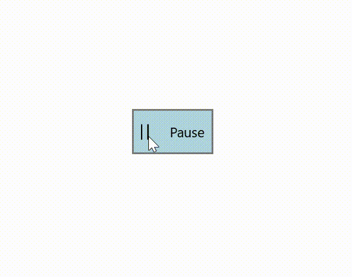

# how-to-customize-the-appearance-of-Xamarin.Forms-button-on-its-hover-in-UWP
This article explains how to customize the appearance of Syncfusion Xamarin.Forms button in its mouse over state as demonstrate in below

 

The above customization has been done with the help of MouseOver visual state in Xamarin.Forms button. Please find the below code snippet to construct the above UI

```
<buttons:SfButton ShowIcon="True" 
                          HorizontalOptions="Center" 
                          HeightRequest="50" 
                          WidthRequest="90" 
                          VerticalOptions="Center">
            <VisualStateManager.VisualStateGroups>
                <VisualStateGroup x:Name="CommonStates">
                    <!--default state customization on Background,Text color,ImageSource and Text property-->
                    <VisualState x:Name="Normal">
                        <VisualState.Setters>
                            <Setter Property="ImageSource">
                                <Setter.Value>
                                    <FontImageSource FontFamily="Assets/Segoe_MDL2_Assets.ttf#Segoe MDL2 Assets" Glyph="&#xE768;" Color="White" />
                                </Setter.Value>
                            </Setter>
                            <Setter Property="BackgroundColor" Value="#00008B"/>
                            <Setter Property="Text" Value="Play"/>
                            <Setter Property="TextColor" Value="White"/>
                        </VisualState.Setters>
                    </VisualState>
                    <!--mouse over state customization on Background,Text color,ImageSource and Text property-->

                    <VisualState x:Name="MouseOver">
                        <VisualState.Setters>
                            <Setter Property="ImageSource">
                                <Setter.Value>
                                    <FontImageSource FontFamily="Assets/Segoe_MDL2_Assets.ttf#Segoe MDL2 Assets" Glyph="&#xE769;" Color="Black" />
                                </Setter.Value>
                            </Setter>
                            <Setter Property="BackgroundColor" Value="#B1D4E0"/>
                            <Setter Property="Text" Value="Pause"/>
                            <Setter Property="TextColor" Value="Black"/>
                        </VisualState.Setters>
                    </VisualState>
                </VisualStateGroup>
            </VisualStateManager.VisualStateGroups>
        </buttons:SfButton>
```
# How to perform the scale animation while mouse over

Currently no direct approach to prepare the scale animation on its mouse over. It has been achieved with the help of Syncfusion Xamarin.Forms SfButton renderer in UWP. Using its pointer entered and exit event, here also customize the cursor icon to hand on its mouse over as follows

 

[XAML]

```
  <local:SfButtonExt x:Name="button" HeightRequest="40" WidthRequest="100" HorizontalOptions="Center" VerticalOptions="Center">
            <VisualStateManager.VisualStateGroups>
                <VisualStateGroup x:Name="CommonStates">
                    <VisualState x:Name="Normal">
                        <VisualState.Setters>
                            <Setter Property="BorderWidth" Value="0" />
                            <Setter Property="BorderColor" Value="Transparent" />
                            <Setter Property="BackgroundImage" Value="Download.png" />
                        </VisualState.Setters>
                    </VisualState>

                    <VisualState x:Name="MouseOver">
                        <VisualState.Setters>
                            <Setter Property="BorderWidth" Value="0" />
                            <Setter Property="BorderColor" Value="Transparent" />
                            <Setter Property="BackgroundImage" Value="Save.png" />
                        </VisualState.Setters>
                    </VisualState>
                </VisualStateGroup>
            </VisualStateManager.VisualStateGroups>
        </local:SfButtonExt>
```
[C#]

```
class CustomButtonRenderer : SfButtonRenderer
    {
        SfButtonExt sfButton;
        protected override void OnElementChanged(ElementChangedEventArgs<SfBorder> e)
        {
            base.OnElementChanged(e);

            if (Control != null)
            {
                Control.PointerMoved += Control_PointerMoved;
                Control.PointerExited += Control_PointerExited;
            }

            if(e.NewElement != null)
            {
                sfButton = e.NewElement as SfButtonExt;
            }
        }

        private void Control_PointerExited(object sender, Windows.UI.Xaml.Input.PointerRoutedEventArgs e)
        {
            Windows.UI.Core.CoreCursor arrowCursor = new Windows.UI.Core.CoreCursor(Windows.UI.Core.CoreCursorType.Arrow, 0);
            Window.Current.CoreWindow.PointerCursor = arrowCursor;
        }

        private void Control_PointerMoved(object sender, Windows.UI.Xaml.Input.PointerRoutedEventArgs e)
        {
            Windows.UI.Core.CoreCursor handCursor = new Windows.UI.Core.CoreCursor(Windows.UI.Core.CoreCursorType.Hand, 1);
            Window.Current.CoreWindow.PointerCursor = handCursor;
            StartAnimation();
        }

        async void StartAnimation()
        {
            //change the scale value based on your requirement
            bool isCancelled = await sfButton.ScaleTo(1.1, 500);
            if (!isCancelled)
            {
                await sfButton.ScaleTo(1, 500);
            }
        }
    }
```


